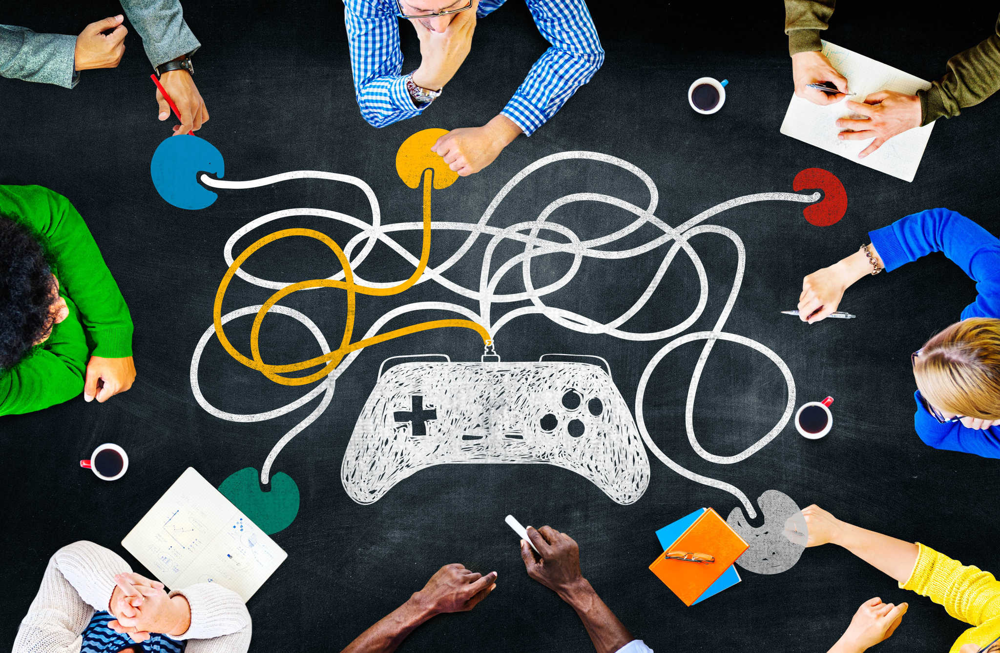

<!-- Google tag (gtag.js) -->

# Gamification and Game Design Concepts for Education
Games have a surprisingly rich history in education and research.
Game theory, as a mathematical and later economical and philosophical study
is about decision making, strategising in order to maximize rewards.

As entertainment media, board games and video games are also modern tools
for learning. 

Looking at them from a design point of view means focusing on reward systems,
achievements, character design and progression, role play, challenge and 
level design, and much more.

Technologically speaking, video games are marvels of programming. Their simulation
of physics, realistic or artistic, are a sight to behold. Analyzing their
implementation provides an excellent example of sophisticated engineering,
that balances performance with realism.

Adding the social aspect to the mix makes multiplayer games into a great
collaboration or competition experience which can stimulate learning.

---

The Hungarian psychologist Mihaly Csikszentmihalyi introduced the concept of
*flow* to describe how an activity hooks us by balancing challenge with reward.
The concept is common to all learning and entertainment experiences and thus can
be applied to learning through games. You want the game to be challenging enough
to not become boring, but also rewarding enough to not lose engagement. But isn't
this also true about a lecture or a quiz for example?

The narrative aspect is also worth keeping in mind, since, unlike movies and books,
games make the player an agent of change, they can and will influence the outcome
of the game. They have to be attached to their character, not as a mere spectator,
but by becoming them, showing empathy.

---

Given the vast overlap of games and learning, how can teachers and students use
game design and game analysis concepts to improve their experience?

Here are some topics we propose:

## Contents
* What do we play and why? Examples of games for challenge, relaxation, learning.
* Keywords used in classical game theory and modern video game industry.
* Types of video games and their specifics.
* Realism and simulation or imagination? Virtual reality and modern computer graphics or text-based games?
* Game design elements:
  + player characters (PCs), non-player characters (NPCs), character design, character arc, progress;
  + tasks and quests: level design, open world, linear design, replayability, new game plus (NG+);
  + rewards, achievements and trophies: gratification, intrinsic and extrinsic rewards.
* Case studies: Duolingo, Kahoot, Brilliant, Dungeons and Dragons;
* Decision making, ethical and philosophical problems in games;
* Physics and mathematics used in graphics programming: models, elasticity, rigid body, lighting, ray tracing, path tracing, tesellation, procedural generation;
* Debates and challenges:
  + What can I use from my favourite games to design an interactive, entertaining, and informative lesson, lecture, or talk?
  + What did I learn from my favourite games? Story, characters, aesthetics and art, difficulty, challenge and reward.
  + What parts of game design are the most relevant to my study topics?
  + Design a game to learn: (1) relativity theory, (2) modular arithmetic, (3) derivatives and differentials.

All study materials are offered free of charge. The games we will present may be non-free, but their purchase is not a requirement.

## Enroll Now
Ready to learn? Write us an [email](mailto:adrianmanea@poligon-edu.ro) or a [WhatsApp message](https://wa.me/40750408128) to get in touch.
We offer a free one-on-one consultation to get to know each other and help you decide.

Undecided? Write us your questions, concerns or proposals. We reply to *all* messages straight away.