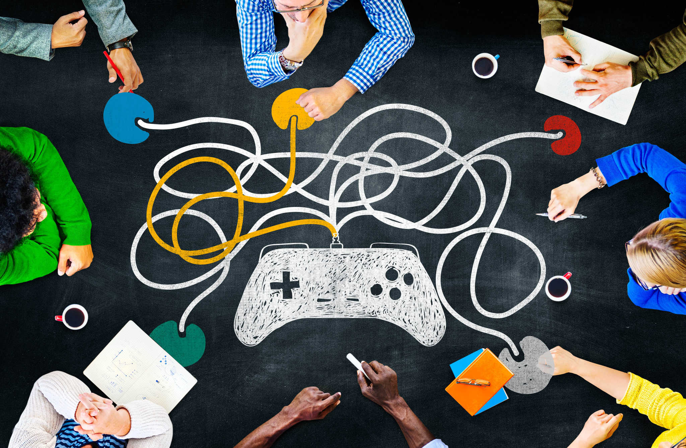

# Gamification și concepte de game design în educație

Odată cu dezvoltarea tot mai amplă a tehnologiilor multimedia, 
care sînt nu doar mai puternice, ci și mai accesibile ca oricînd, 
educația se adaptează și utilizează metode tot mai sofisticate de 
prezentare și acumulare a cunoștințelor. Învățarea prin descoperire 
capătă noi sensuri atunci cînd ai la dispoziție un laborator virtual 
în care nu există riscuri reale, indiferent de experiment.

Tehnologia, așadar, facilitează învățarea, un adevăr de care sîntem cu toții conștienți. 
Însă nu doar vizualizarea și imersiunea în medii virtuale ne ajută să acumulăm 
cunoștințe ori să ne satisfacem curiozități și, în general, interesul ori setea 
de cunoaștere. Avem mult mai multe de învățat de la și prin jocuri decît 
relaxarea și simularea realistă.

---

În 1938, Johan Huizinga publica *Homo Ludens*, o carte de istorie culturală 
și antropologie în care arăta că jocul este o componentă fundamentală din 
viețile noastre și că, mai mult, numeroase activități pot fi înțelese și 
desfășurate ca și cum ne-am juca. Există reguli, mecanici, condiții de 
victorie, învingători și învinși.

În anii 1970, psihologul de origine maghiară Mihaly Csikszentmihalyi propune 
conceptul de *flow* — acea stare a minții prin care sîntem conectați la maximum 
la procesul pe care îl desfășurăm. Atenția, concentrarea și imersiunea, dar 
și satisfacția sînt la cote potrivite și dăm tot ce avem mai bun.

Spre deosebire de filme ori alte creații multimedia, jocurile video au 
meritul interactivității și transpunerii în pielea personajului. Astfel de 
creații deosebite ne fac protagoniștii unor povești pe care noi 
înșine le scriem, cu mai multă ori mai puțină libertate. Concepte precum 
*level design*, *character design*, *character progression* și *role playing* 
sînt esențiale în tăria legăturii între jucătorul uman și personajul-jucător 
(PC, *player character*).

Apoi, simpla mențiune a termenului *jocuri de societate* sau *board games* 
deschide un cu totul alt tărîm: componenta socială a jocurilor, care în 
zona virtuală se completează cu termenul de *multiplayer*.

Iar peste toate, satisfacția oferită de victorie sau, uneori, chiar de experiența 
însăși, este o componentă esențială. Cum recompensezi jucătorul pe parcurs astfel 
încît să fie motivat să continue și să ajungă la starea de *flow*? Cum le răsplătești 
efortul final de a fi învins jocul? Ce fel de recompensă este potrivită pentru ca 
jucătorul să simtă că a cîștigat nu doar jocul în sine, ci și o informație sau o 
experiență? Cum alcătuiești un joc pentru relaxare, pentru cei care nu sînt competitivi?

Propun un curs care să exploreze toate ideile de mai sus, atît în ce 
privește jocurile înseși — clasice ori digitale —, cît mai ales în aplicații 
și conexiuni ale acestora cu educația. 

Înlocuiește cuvintele din familia lexicală 
a „jocului” cu unele precum „lecție”, „capitol din materie” sau chiar exemple 
concrete: „analiza matematică”, „mișcarea circulară”, „algoritmica grafurilor” 
și întrebați-vă: cît de mult și cum puteți păstra din factorul distractiv, 
ludic, dar și din recompense? Abia de aici putem porni discuția.

## Cuprins
* Ce ne jucăm și de ce? Exemple de jocuri. Motivație, relaxare, învățare.
* Termeni generali din teoria clasică a jocurilor și industria jocurilor video. Clasificarea jocurilor.
* Realism și simulare sau imaginație? Realitatea virtuală și grafica avansată sau jocuri cu cărți și jocuri narative?
* Elemente de design al jocurilor:
    + personajul-jucător și personaje secundare, design și progres;
    + sarcini și progres: level design, quests, open world design, linear design, replayability;
    + recompense și trofee: gratification, recompense intrinseci și extrinseci, importanța numerelor;
* Studii de caz ale jocurilor pentru educație și socializare: Duolingo, Brilliant, Kahoot, D&D și role playing.
* Probleme decizionale, etice și filosofice în jocuri.
* Elemente de fizică și matematică relevante în programarea grafică. Studii de caz: 
Analizăm apariția metodelor, problemelor și soluțiilor în diverse jocuri. 
Elasticitate, dinamica corpului rigid, lumini și umbre volumetrice, reflexii, 
caustică, ray tracing, path tracing, tessellation.
* Dezbateri și aplicații:
    + Ce pot prelua din jocurile preferate pentru a organiza o lecție de matematică? Dar una de fizică? Dar una de literatură?
    + Ce am învățat din jocurile preferate: poveste, personaje, grafică, dificultate și recompensă, relaxare?
    + Ce (părți din) jocuri alegem pentru a ilustra concepte științifice? Dar culturale sau istorice?
    + Concepeți un joc din care să învățați: teoria relativității, aritmetica modulară, studiul funcțiilor cu ajutorul derivatelor.

Toate materialele utilizate în timpul cursului sînt complet gratuite. 
Jocurile pe care le vom menționa și demonstra pot fi contra cost, însă achiziționarea 
lor nu reprezintă o obligație sau o condiție și este la alegerea cursantului.

## Curios?
Scrie-ne prin [email](mailto:adrianmanea@poligon-edu.ro) sau 
[WhatsApp](https://wa.me/40750408128) și hai să stabilim împreună planificarea întîlnirilor!

Scrie-ne și dacă ai întrebări, neclarități sau propuneri!