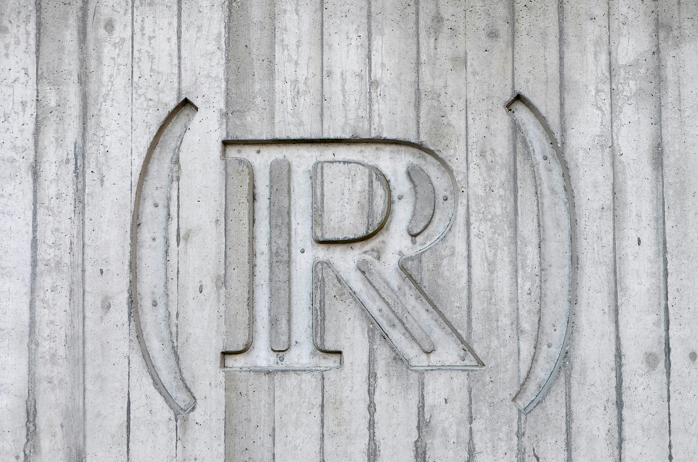

# History and Philosophy of Mathematics

When you read "The Set of Real Numbers", the subtitle we proposed for this course,
it may seem bland. After all, it's just another well-known, perhaps boring chapter
in your textbooks, right? How could we possibly discuss tens of hours about real
numbers so that it doesn't feel like an uninspiring school lecture?

*Challenge accepted!*

Many important topics in mathematics and natural science start with real numbers.
For one, calculus would be impossible without them and consequently, most of
physics, which is, above all, the science of change, would have been impossible
without real numbers.

But you're not here for lectures in mathematics or physics *per se*. The truth is
that when you search for the origins, the starting point of such ideas that turned
into real numbers, you are bound to discover the unescapable connection to
*infinity* and *continuity*. These are two of the most important ideas in the
history of science and philosophy and I will show you how they are inextricably
linked to real numbers.

In fact, I want to discuss this topic word by word.

## The Set
* What's a set?
* When did the concept emerge and what was it used for?
* What's *not* a set?
* Why is it called a "set" and what meaning do the words for it in other languages have?

Exploring such questions takes us directly to the *problem of infinity* and *continuity*.
At the same time, we're also facing the so-called "small infinity" or *infinitesimal*,
which, again, is key to understanding continuity.

Infinity appears quite easily in the history of mankind, in relation to the divinities.
If the religions and theologies all over the world agree on one thing, that's the infinite
nature of (the) god(s) or at least some powers it is endowed with. 

But what does this have to do with mathematics or physics? You will be surprised to find out
that some scholars made the first conjectures about mathematical infinity or what we call today
calculus in relation to divine attributes. In fact, up until the nineteenth century, researchers
believed that it would be a heresy to speak of anything else but God to be infinite.

However, a daring Greek philosopher, by the name of Anaximander, who lived in the sixth and
seventh centuries BC in Miletus, spoke of infinity *per se*. His *apeiron* was simply "the infinite".
What was such a daring mind thinking in those times and how did his ideas influence the further
evolution of the concept? Forward about 2500 years, what do we mean by infinity today?

And to be honest, there's an infinite number of infinite sets, so why focus on the set of
real numbers? Or any set, for that matter? These are also good questions we'll explore.

## (Of) Real
How could numbers such as *e* or π be called "real"? Looking around, one could at most
see natural numbers, or, according to some philosophers, only ones and multitudes of ones.
Half an apple is, in fact, a "one" ― one object, which happens to be called a "half".

If we are to believe mathematicians and physicists, real numbers are so called because
they are good to describe "reality", whatever that means. But how can reality be described
by objects that are infinite in nature? Isn't π a number with an infinite row of
decimal digits, all of which are unpredictable? What's real about that?

To make matter(s) more abstract, physicists started using real numbers early on,
and in the twentieth century, they even exceeded the set of real numbers and started
using complex numbers for the quantum theory. This suggests that physical reality
is, indeed, a good match for sophisticated number sets.

Finally, we cannot avoid discussions about the very concept of "reality", hence 
we will also discuss *realism*, as the concept appears in the philosophy of science
and see how it matches our intuitive understanding. You would normally think
that you know what it means for something to be real, right? Maybe.

## Numbers
* What's a number?
* Who invented numbers and why?
* What are numbering systems, how and why did they appear?
* How did number sets get extended: from natural, to integers, to rational, to real, to complex, and hypercomplex?
* How far could such an extension go? Do we ever finish creating numbers?
* How does our brain process numbers? Are there differences between the psychology of understanding letters and words and numbers?
  
Such questions suggest a wide array of topics, spanning millennia. Adding to the list the
history of the most famous number of them all — *zero* — sparks numerous other talks.
But why? Why would one want to write nothingness and work with it?

For starters, similar questions could be asked about negative numbers. Who would want to
work with debt? Or with "imaginary numbers" (aren't they all *imaginary*?)

Mathematically speaking, numbers are closely connected to *cardinality*. When speaking
about 5, most of us think of *five somethings*; abstractly speaking, five elements of a set.
But then what do we do about the entire set of natural numbers or of real numbers?
They are clearly infinite, but is infinity a number? Why (not)?

And did you know that, regardless of infinity being a number or not, there are multiple
types of infinity, ones larger than the others? Now you do and we will tell you more about it.

## Enroll Now
Ready to learn? Write us an [email](mailto:adrianmanea@poligon-edu.ro) or a [WhatsApp message](https://wa.me/40750408128) to get in touch.
We offer a free one-on-one consultation to get to know each other and help you decide.

Undecided? Write us your questions, concerns or proposals. We reply to *all* messages straight away.