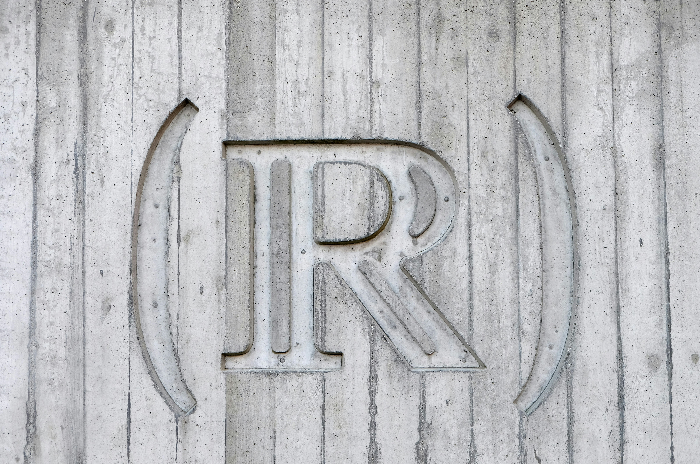
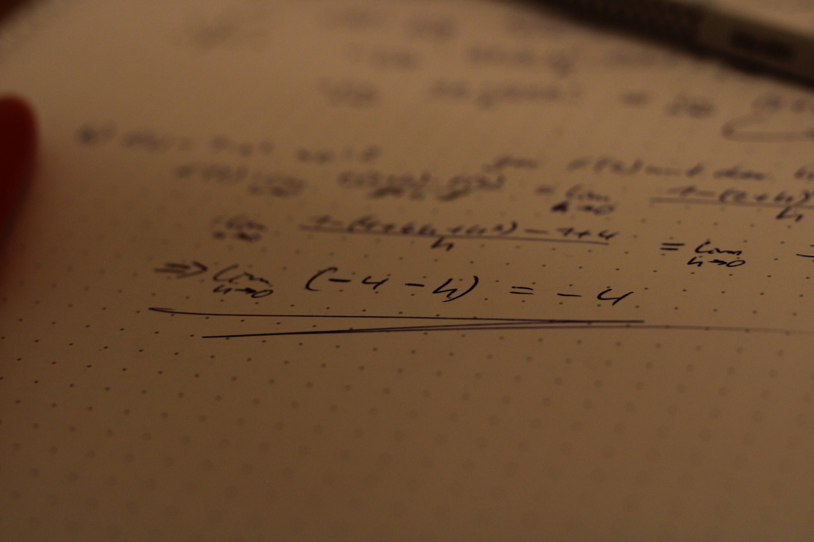

# Istoria și filosofia matematicii: Mulțimea numerelor reale

Subtitlul propus, „Mulțimea numerelor reale“, este foarte general și, poate, neatrăgător.
Pînă la urmă, este un titlu de capitol din manualul de matematică al clasei a IX-a. 
Însă o astfel de caracterizare ar fi cel puțin superficială 
și vă explic în continuare de ce. Am vrut să vă întrebați *„Oare cum am putea să*
*vorbim cîteva zeci de ore despre un capitol din manual care se studiază în 2-3 săptămîni?“*

Prin mulțimea numerelor reale iei contact cu multe probleme foarte importante, nu doar în matematică.
Intervalele de numere reale și operațiile cu ele, apoi funcțiile reale și analiza matematică 
a claselor a XI-a și a XII-a (ca să nu mai vorbim de analiza reală multidimensională 
studiată în primii ani de facultate) sînt subiecte fascinante, cu aplicații în mai toate
științele naturii. 

Tot numerele reale sînt esențiale și în informatică, unde tipul de date `float` are parte de un 
tratament diferit în majoritatea limbajelor de programare. 

Și tot ele au generat multiple probleme filosofice fascinante, 
atît în ce privește natura lor continuă, cît și cardinalul lor, care este „un infinit mai mare“ 
decît acela al numerelor naturale.

Cît despre istoria numerelor reale, există salturi 
și legături dintre cele mai surprinzătoare. Încă din perioada mesopotamienilor — adică 
din mileniile VI-V î.e.n. — apar radicali și logaritmi. Dar înțelegerea lor și mai 
ales fundamentarea în matematică a venit extrem de tîrziu: tocmai în secolul al XIX-lea.

Am schițat o parte a laturilor pe îți propun să le discutăm. Acum să luăm subtitlul pe componente.

## Mulțimea
* Ce este o mulțime?
* Cînd a apărut conceptul abstract de mulțime și la ce a folosit? 
* Ce *nu* este o mulțime? 
* Ce legătură există între *mulțime* și *multitudine*, matematic și etimologic? 

Pornind de la astfel de întrebări, ajungi repede la *problema infinitului*, una dintre cele 
mai importante din istoria matematicii și filosofiei. Odată cu ea, apare imediat cea a *infinitului mic* 
sau *infinitezimal*, care conduce la problema continuului. 

Infinitul apare destul de rapid în istoria omenirii, în legătură cu divinitatea.
Aproape toate culturile atribuie calitatea de a fi infinit divinității sau 
divinităților pe care le venerau. Însă cum a fost adus infinitul „printre oameni“ și 
mai ales în abstract și cîte eforturi s-au făcut pînă ce acest concept a fost și 
definit riguros constituie o poveste care acoperă cel puțin trei milenii. În plus,
toate subiectele privitoare la divinitate sînt sensibile, iar legătura cu matematica
nu este o excepție.

Așadar, în acest prim modul discutăm istoria și dezvoltarea filosofică și matematică a conceptului de mulțime.
Nu putem face acest lucru decît în strînsă legătură cu conceptele de *infinit* și 
*continuitate*, iar prin aceasta, traversăm mileniile și ne oprim la unele dintre cele mai 
luminate minți: de la Thales și Anaximandru, la Aristotel, Fermat, Newton, Galileo, Leibniz 
și pînă la Cantor, Zermelo, Fraenkel, privind, totodată și spre viitor, prin ochii și 
teoriile lui Lawvere, MacLane, Robinson și alții.

## Numerelor
* Ce este, riguros, un număr? 
* Cine a inventat numerele și pentru ce scop? 
* Ce sisteme de numerație există și cum a evoluat scrierea numerelor? 
* Care numere au apărut prima dată și în ce context? 
* Ce motive și probleme științifice au condus la extinderea mulțimilor de numere, de la naturale, la întregi, raționale, reale și mai departe?
* Cît de departe, cît de mult putem extinde mulțimile de numere și de ce am face asta?
* Cum înțelegem numerele și cum diferă, din punct de vedere psihologic și neurologic, însușirea unui număr de însușirea unui cuvînt sau a unei litere oarecare?

Povestea numerelor este simultan una dintre cele mai simple în aparență — tocmai pentru 
că avem impresia că ne este foarte la îndemînă conceptul de număr —, dar și una dintre 
cele mai profunde, întrucît pînă în zilele noastre, nu există un răspuns singular și 
complet la prima întrebare: Ce este, riguros, un număr? Matematicienii le vor lega 
de mulțimi, fizicienii, de stări și cantități ale materiei, filosofii, în funcție 
de școala căreia aparțin, de imagini mintale, de obiecte, de nume și așa mai departe.

Și totuși, fără să știm ce este, de fapt, un număr, lucrăm cu ele poate mai confortabil 
chiar decît cu literele. De-a lungul istoriei, numerele s-au bucurat de diverse statute 
și interpretări: de la aplicații directe în gospodărie, economie, probleme funciare, 
măsurători geometrice, ele au ajuns să fie chiar venerate, prin presupusa omniprezență, 
de către Pitagora și adepții săi. În plus, dintre toate numerele, *zero* a avut un statut 
special. *Cum să reprezinți nimicul și de ce ai avea nevoie să faci asta?*

Tot dificilă a fost și acceptarea diverselor tipuri de numere: cele negative nu 
erau utilizate pe scară largă pînă în evul mediu, cele iraționale, sporadic și 
fundamentate riguros tocmai în secolul al XIX-lea, iar cele complexe și hipercomplexe 
au avut, la rîndul lor, istorii complicate. Nu în ultimul rînd, o legătură imediată 
între numere și mulțimi se face prin *numerozitate* sau *cardinal*.
Lesne de înțeles că o paletă atît de bogată de aplicații, dar și de 
dificultăți, vine însoțită de una corespunzătoare, din punct de vedere filosofic.

## Reale
De ce ar fi numere precum π, e și radical din 2 „reale“, din moment ce în jurul nostru, 
dacă este să vedem vreun număr, le vedem doar pe cele naturale? O jumătate de pîine este, 
fie o instanță a numărului 1/2, dacă o raportăm la pîinea întreagă, fie una a numărului 1, 
dacă ne gîndim că este, totuși, un obiect, ignorîndu-i proveniența.

Dar cum poate fi „real“ ceva ce are o infinitate de zecimale? Unde se realizează 
aceste numere, din moment ce nu le vom putea scrie sau vedea vreodată în întregime? 

Prima direcție care justifică, măcar parțial numele, este în fizică. 
Ce disciplină reprezintă mai bine „realitatea“ (orice ar însemna acest lucru) 
dacă nu fizica? Și vom vedea că, în fizică, numerele reale (chiar și cele precum π și e 
— mai ales acestea, de fapt) sînt... naturale! Adică apar aproape fără efort în 
ecuații care modelează procese și fenomene fundamentale: de la legi de mișcare la 
ecuații fundamentale care guvernează lumea subatomică.

Fără a intra prea adînc în problemă, trebuie să avem o idee generală asupra conceptului 
de *realitate*, așa cum apare el în caracterizările filosofilor. Și revenind la abstractul
matematic, cît de departe și unde putem merge cu astfel de mulțimi 
de numere? Dacă extinderea de la numere naturale la întregi, apoi la raționale, 
la iraționale și chiar la complexe pot fi justificate de probleme matematice care 
se studiază chiar în liceu, ce putem spune despre numerele hipercomplexe? 

În fine, ne întrebăm ar putea exista matematica fără numere? Putem vorbi despre 
proprietăți similare celor ale mulțimii numerelor reale în cazul unor alte structuri, 
care nu conțin numere? De ce am face asta și ce fel de probleme ar rezolva?

## Curios?
Scrie-ne prin [email](mailto:adrianmanea@poligon-edu.ro) sau 
[WhatsApp](https://wa.me/40750408128) și hai să stabilim împreună planificarea întîlnirilor!

Scrie-ne și dacă ai întrebări, neclarități sau propuneri!