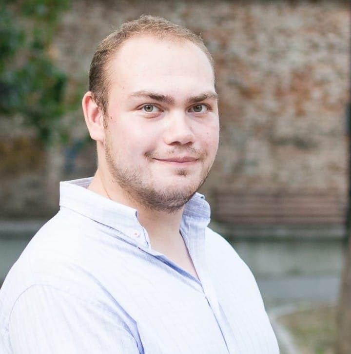

<!-- Google tag (gtag.js) -->

# Joshua P. Biro

Salut!
 
Sunt Patrick-Joshua Biro - cercetător în formare și pedagog. 

Interesele mele includ predarea științelor, promovarea relevanței educației în comunitate,
dar și popularizarea de concepte științifice.

Am susținut mereu valoarea de a adresa 
întrebări faine despre diverse aspecte ale lumii în care trăim.
 
## Traseu educațional

Am absolvit Colegiul Național „Mihai Eminescu” Oradea, specializarea științe
ale naturii, în anul 2019. Din toamna aceluiași an până în 2022 am urmat 
studiile la Universitatea din Oradea - specializările Fizică Medicală și 
Istorie -, după care am continuat cu studiile de masterat în Fizică 
Medicală. Din octombrie 2025 sunt doctorand în Sociologie la aceeași universitate.
 
De la vârsta de 14 ani, m-am implicat în diverse activități de voluntariat. 
Acestea au inclus scrierea creativă, promovarea drepturilor persoanelor 
care trăiesc cu dizabilitate, precum și comunicarea științifică.
 
În 2024 am absolvit un curs intensiv de formare de formatori (Training of Trainers).
 
## Realizări profesionale

Îmi place să îi ridic pe alții și să îi ajut să înțeleagă că eforturile 
lor nu sunt în zadar. Pentru a putea pune și în practică acest principiu, 
m-am familiarizat cu disciplina acestui efort încă din liceu. Prima olimpiadă 
la care am ajuns la faza națională a fost în clasa a X-a, la Istorie, 
în 2017, când am obținut premiul al II-lea la etapa finală. 

Un an mai târziu, am luat mențiune la aceeași etapă, dar și premiul 
High Commendation la concursul internațional de eseuri al Institutului 
John Locke din Oxford.
 
În timpul studiilor de licență și de masterat, am participat la peste 
zece conferințe naționale și la un podcast internațional de radioterapie. 
Am adaptat lucrarea mea de disertație într-o carte intitulată 
[„Dincolo de manual: explorări didactice în fizica atomică, nucleară și medicală”](https://www.librarie.net/p/502610/dincolo-de-manual-explorari-didactice-in-fizica-atomica-nucleara-si-medicala).
 
Prin toate aceste experiențe, am ajuns mai dornic să-i înțeleg și 
pe cei din jurul meu. Nu sunt străin de burnout și de îndoiala care 
mai apare din timp în timp, ceea ce mă motivează să aduc claritate 
în predarea științelor și nu numai.

---

Sunt bucuros să fiu parte a echipei Poligon Educational din ianuarie 2026,
iar pentru colaborări sau alte întrebări, îmi puteți scrie la
[`joshuabiro@poligon-edu.ro`](mailto:joshuabiro@poligon-edu.ro).
 