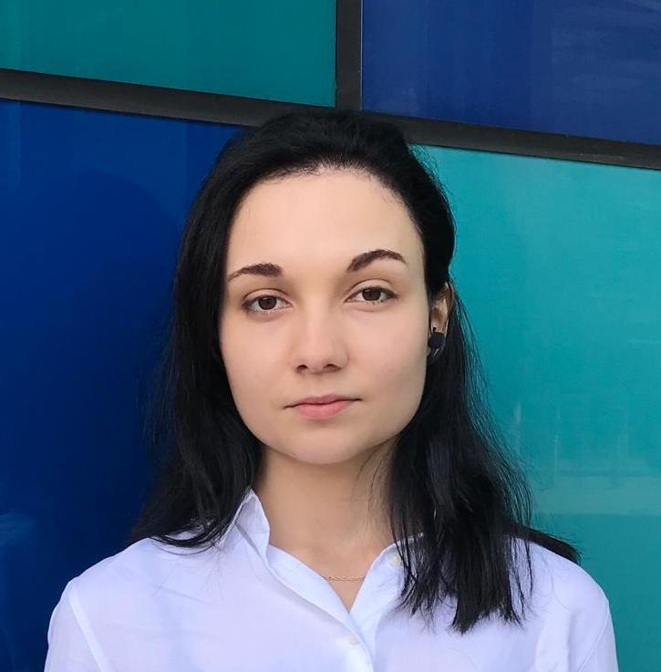

<!-- Google tag (gtag.js) -->

# Maria Kapros

Hi all! 

I'm Maria and within the Poligon team I teach private lessons for high-school level mathematics (IB and Romanian Baccalaureate).  

I also produce popular science articles on practical, beautiful, or inspiring knowledge bites from some of my subjects of interest: 

* The intersection between mathematics and natural science;
* Neuroscience and its applications;
* History and philosophy of science 

My academic experience so far includes: 

* Undergraduate and Masters in Computer Science at University College London, focused on [AI](https://drive.google.com/file/d/1qmXVF0QMRMmvEP7CvLNpdiZDO_UfYBRC/view?usp=sharing) and [cybersecurity](https://docs.google.com/document/d/1v4gZyQxRqGuydrKtGryMsas9QjlN7FX7/edit?usp=sharing&ouid=109759994726725696307&rtpof=true&sd=true).
* Research Assistant in FinTech, having developed a [system prototype for CBDC](https://www.notion.so/FIRE-project-13876ffeff4d80ebaa35f18883e865e5?pvs=21) (Central Bank Digital Currency). 
* Recently, I pivoted to mathematics with a focus on both education and research. 

I am currently enrolled in a postgraduate program in Advanced Mathematics at the Babeș-Bolyai University of Cluj Napoca. 

I'm interested in an academic research career in applied mathematics with a focus on neuroscience. Equally, I want to help improve the mathematics literacy in Romania with educational and research projects. 

Feel free to get in touch at [`mariakapros@poligon-edu.ro`](mailto:mariakapros@poligon-edu.ro).