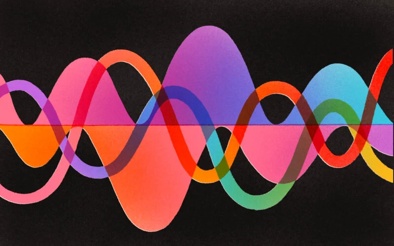

# Music: Language, Mathematics, Physics
Music is communication, relaxation, entertainment, emotion.
You don't have to know music theory to be moved by a song, sometimes
literally. 

But even if music is first and foremost a form of art, that doesn't mean
we cannot discuss it scientifically.

Here are some starting points.

## The Mathematics and Physics of Music
Fundamentally, music is sound, which is literally repeated, patterned air movements.
They take the form of waves, *sound waves*. Physically, they are similar to light,
but also tidal waves. Mathematically, they are modelled by complicated equations,
but none of these matter when we just listen.

However, knowledge about the mathematical and physical properties of sounds (and music)
will be useful to understand part of its history, starting with Pythagoras and all the
way to modern and experimental music.

## Time Signatures, Rhythm, and Polyrhythm
The *beat* is what makes most of the music. It's what separates a relaxing song
from one that makes you bounce and dance. Furthermore, the rhythm (aka the beat)
is one of the most important properties that are fit for mathematical study.

If you've ever seen a music sheet, you may have noticed the numbers which look like
a fraction that appear at the beginning of the staff. 4/4 is the most common, but there
are also more exotic examples, like 17/8, 7/2 or 11/32. What do these fractions mean
and how do they influence (the sound of) music?

More recent and experimental music offers even more surprising examples that use such
fractions, in the form of *polyrhythms*. In a song, instruments can play according to
different fractions (called *time signatures*): the guitar solos in 7/8, while the
drum beats at 4/4 and the bass at 7/4. Is there more to such an example than arithmetic?

Ancient history offers an even more intriguing example: *Euclidean rhythms*.
The Euclidean algorithm, that we all know for repeated long division, gives rise
to music, and some modern electronic (or software) instruments have implemented it.

## Language
Some researchers argue that music is a language. It does have a *message*, hence an
information content, as well as a *syntax* (rules to form words and phrases) in a 
*vocabulary* made of notes, rests, measures, or movements.

One of the most spectacular presentation of this thesis is by the great American
composer and conductor Leonard Bernstein. In 1973, he taught a course at Harvard
titled *The Unanswered Question*, where he traces the history of music in close
connection to natural language.

Furthermore, we know there are language centers in our brains, but if music is
a language, are there music centers? Conversely, if there are music centers
in our brains, how do they work and can they be used as proof that music and
language are processed similarly?

Two books will help us answer such questions:
* *Musicophilia*, by the esteemed neurologist Oliver Sacks and
* *This Is Your Brain on Music*, by the psychologist and neuroscientist Daniel Levitin.

## Enroll Now
Ready to learn? Write us an [email](mailto:adrianmanea@poligon-edu.ro) or a [WhatsApp message](https://wa.me/40750408128) to get in touch.
We offer a free one-on-one consultation to get to know each other and help you decide.

Undecided? Write us your questions, concerns or proposals. We reply to *all* messages straight away.