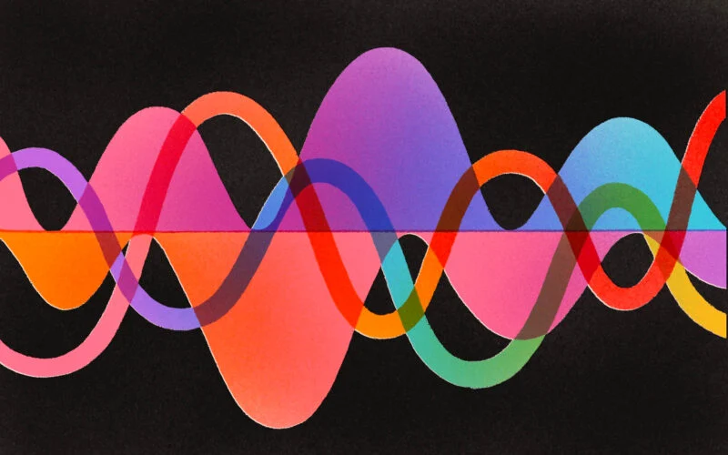

# Muzica: Limbaj, matematică, fizică

Ce asocieri faci cînd te gîndești la muzică? 
*Emoție, senzație, ritm, pulsație, sunetul muzicii, limbajul muzicii...*

Muzica este o formă de comunicare, o metodă de relaxare, o 
formă de divertisment, o cale de a transmite și a induce bună 
dispoziție, teamă, suspans și, în general, un spectru larg de 
emoții și idei. Nu trebuie să ai o pregătire muzicală, nici chiar 
așa-zisa ureche muzicală ca să fii emoționat de o piesă, uneori chiar 
și de cîteva note numai. Îți simți pulsul sincronizat cu ritmul melodiei, 
capul și picioarele încep să se miște incontrolabil.

Chiar dacă muzica este o formă artistică, putem să o discutăm și științific.

Iată cîteva puncte de pornire.

## Matematică și fizică
Muzica se bazează fundamental pe sunet, care, spus prozaic, 
este o mișcare ordonată și repetată a aerului, sub forma unor unde — *unde sonore*. 
Fizic, ele au proprietăți comune cu lumina, dar și cu valurile. 
Matematic, sînt reprezentate prin ecuații complicate, dar nu 
ne împedică astfel de detalii pentru a aprecia muzica.

Trebuie, totuși, să vorbim despre proprietăți științifice esențiale ale undelor (implicit, ale sunetelor), care 
ne ajută să le înțelegem în contextul muzicii: amplitudinea, frecvența, faza, dar 
și proprietăți muzicale specifice, precum notele, timbrul și cadența. Înțelegerea 
lor ne va permite să facem o călătorie istorică și multiculturală în care să explorăm 
diferențele între muzica orientală și cea occidentală, cel puțin din punctul de 
vedere al aranjării notelor în game și moduri specifice. Totodată, vom putea 
explora istoria organizării muzicii, de la ideile lui Pitagora, pînă la structurile moderne.

## Măsură, ritm și poliritm
Ritmul, *beat*-ul este inima oricărei melodii, pulsația care face diferența între 
o piesă relaxantă și una care te face să dansezi aproape incontrolabil. Totodată, 
ritmul este și una dintre proprietățile cele mai potrivite pentru un studiu matematic, 
aritmetic chiar. 

Dacă ai văzut o partitură, sigur ai remarcat numerele scrise ca fracție 
la capătul portativului. 4/4 apare cel mai des, dar și cu exemple exotice 
precum 17/8, 7/2 sau 11/32. Ce înseamnă aceste fracții și ce importanță au 
ele în transmiterea mesajului muzicii?

Muzica modernă și experimentală lucrează cu astfel de fracții tot mai ciudate, 
ba chiar și cu mai multe odată, alcătuind așa-numiții *poliritmi*. Într-o piesă, o anume 
fracție (sau măsură) e urmărită de un instrument ca tobele, iar chitara poate 
lucra cu o altă măsură. 

Există compozitori și trupe care au dus ideile la extrem 
și au creat adevărate exerciții matematice în compozițiile lor, bazate pe numere 
prime, pe descompunere în factori, pe numitori comuni. Aici se încadrează și ideea 
*ritmurilor euclidiene*, o tehnică de compoziție bazată pe simpla împărțire cu rest, 
pe care o învățăm în școala primară.

## Limbaj
Mai mulți cercetători argumentează că muzica este, printre altele, un limbaj. 
Pînă la urmă, are un mesaj, deci un conținut informațional, precum și o sintaxă — reguli de 
formare a cuvintelor — dintr-un vocabular alcătuit din note muzicale și pauze. 

Una dintre 
cele mai spectaculoase prezentări ale acestei idei îi aparține marelui compozitor și 
interpret american Leonard Bernstein, care, într-un curs din 1973 ținut studenților 
de la Harvard, sub titlul *Întrebarea fără răspuns* (*The Unanswered Question*) face o 
incursiune în istoria muzicii plină de paralele cu limbajul natural.

Limbajul are arii dedicate ale creierului 
prin care se înțelege și se produce. Dar muzica? Avem și acest argument pentru a susține 
că este un limbaj? Există zone ale creierului specifice muzicii? Două lucrări de 
referință susțin răspund afirmativ și le vom discuta împreună: *Musicophilia*, a neurologului
britanic Oliver Sacks și *This Is Your Brain On Music*, a psihologului și cercetătorului 
în neuroștiințe Daniel Levitin.

## Curios?
Scrie-ne prin [email](mailto:adrianmanea@poligon-edu.ro) sau 
[WhatsApp](https://wa.me/40750408128) și hai să stabilim împreună planificarea întîlnirilor!

Scrie-ne și dacă ai întrebări, neclarități sau propuneri!