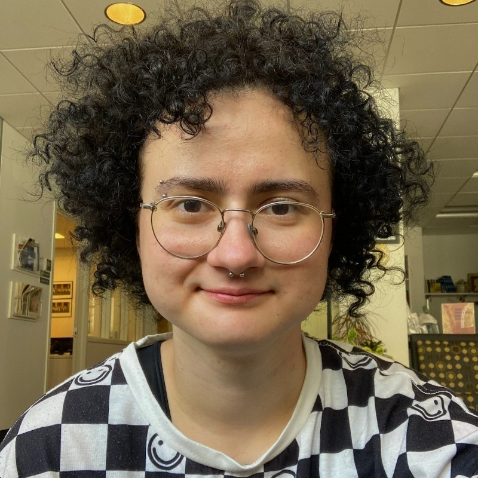

<!-- Google tag (gtag.js) -->

# Răzvan Z. Vulpe

Salut! 

Eu sunt Răzvan Z. Vulpe – matematician, designer și pasionat de popularizarea științei. 

## Educație și Viață Profesională 

În mai 2023, am absolvit facultățile de Informatică și Literatură Engleză la Smith College în Northampton, Massachusetts. După facultate, am rămas în America încă doi ani, cât timp am fost profesor de matematică la liceu.  

După ce m-am întors în România, în Iulie 2025, am început colaborarea cu Poligon Educational, unde îmi continui cariera în domeniul matematicii. 

La facultate, am organizat workshop-uri despre cum să creezi o cultură a unei echipe și spații în care participanții să se simtă confortabil să discute subiecte sensibile. Perioada pe care am petrecut-o în training pentru aceste experiențe m-a format ca profesor. 

## Proiecte și alte reușite

În liceu și gimnaziu, am ajuns până la nivelul de baraj pentru Olimpiada Internațională de Matematică. 

La facultate, m-am concentrat pe informatică; în anul trei, am început să fac cercetare în domeniul interacțiunii dintre om și computer, pe tema singurătății în spațiul de live-streaming. 

Am realizat interviuri cu streameri și parte din cercetare a fost prezentată în cadrul a două conferințe: [MAGICC](https://magicc.acm.org/) și [Celebrating Collaborations](https://www.smith.edu/about-smith/college-events/celebrating-collaborations).

## Planuri

Planurile mele de viitor sunt să public cercetarea pe care am făcut-o și să creez materiale de popularizare a științei. Îmi doresc să fac matematica mai accesibilă pentru publicul general. 

Sunt mereu interesat de optiuni de colaborare! 

Puteți sa dați de mine prin email la [`razvanvulpe@poligon-edu.ro`](mailto:razvanvulpe@poligon-edu.ro) sau pe [Linkedin](https://www.linkedin.com/in/rhys-z-vulpe/).