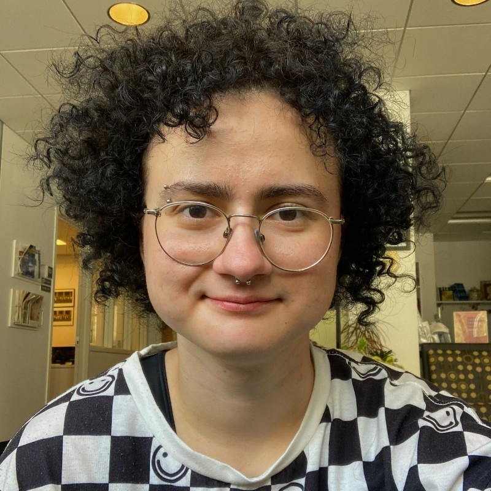

<!-- Google tag (gtag.js) -->

# Răzvan Z. Vulpe

Hello, world! 

My name is Răzvan Z. Vulpe and I am a mathematician and designer, with a passion for scientific literacy and education. 

## Education and Professional Life 

In May 2023, I graduated with a BA in Computer Science and English Literature from Smith College in Northampton, Massachusetts.  

After college, I stayed in the US for an additional two years and worked as a high school mathematics professor.  

In July 2025, I returned to Romania and started my collaboration with Poligon, thus continuing my career as a mathematician. 

During college, I organized workshops about creating team culture and about creating spaces in which the participants feel comfortable approaching important and sometimes difficult topics. The time I spent in training for these experiences shaped me as a teacher. 

## Achievements and Projects

I would often attend the Maths Olympiad in high school and middle school, reaching the point of the International Mathematics Olympiad trials.  

While in college, I changed my focus to Computer Science; in year three, I started doing research in the Human-Computer Interaction area, on the topic of loneliness in streaming spaces.  

I interviewed streamers and part of my research was presented during two conferences, [MAGICC](https://magicc.acm.org/) and [Celebrating Collaborations](https://www.smith.edu/about-smith/college-events/celebrating-collaborations).

## Plans 

My plans are to publish the research I’ve done and to create popular science materials with the Poligon team, making mathematics more accessible to a general audience. 

I’m always open to collaboration! You can reach me via email at [`razvanvulpe@poligon-edu.ro`](mailto:razvanvulpe@poligon-edu.ro) or connect on [Linkedin](https://www.linkedin.com/in/rhys-z-vulpe/).