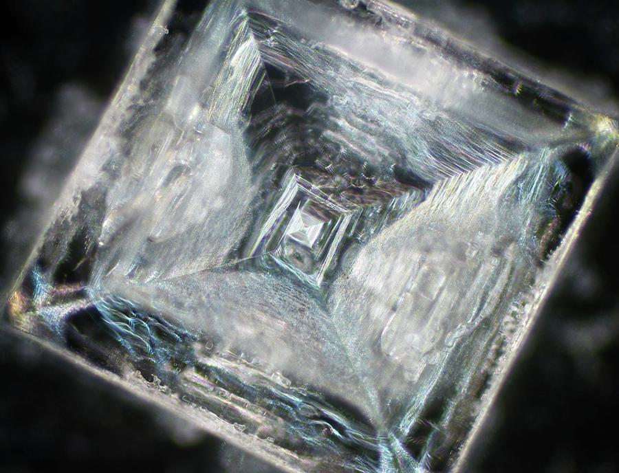

<!-- Google tag (gtag.js) -->

# Despre simetrie: estetică, matematică, științe ale naturii

Simetria este un atribut pe care îl percepem aproape inconștient; 
ne-am obișnuit ca obiectele pe care le apreciem drept simetrice să 
pară naturale, ușor de înțeles, adică de perceput în ansamblu, și chiar frumoase. 

Iar simetria nu se referă doar la elemente vizuale, la tipare, la forme geometrice 
și obiecte arhitecturale sau de artă. Simetrice pot fi și cuvinte, expresii, 
structuri muzicale, numere sau întîmplări. Palindromul este un astfel de exemplu: 
o structură care prezintă o simetrie de reflexie, o oglindire. Ea rămîne la fel, 
fie că este citită de la stînga la dreapta sau de la dreapta la stînga. 
Exemple simple includ cuvîntul CAPAC și numărul 12321.

Rolurile simetriei în cultura, civilizația și știința dezvoltate încă de la 
începuturile timpurilor au depășit cu mult arta. 
Dar ce înseamnă exact că o figură este simetrică? Cum poți 
caracteriza observația în sens abstract, științific? Cum definești simetria? 
Și de cîte tipuri este ea, pentru că trebuie să existe diferențe între a 
vorbi despre un triunghi echilateral, un pătrat sau un hexagon, din punctul 
de vedere al simetriilor lor. 

Deja folosim pluralul pentru a ne referi 
la simetrie, pentru că există mai multe tipuri
de *transformări de simetrie* — acesta este termenul matematic potrivit.

## Cuprins
Originea istorică a conceptului de simetrie este bazată pe măsurători, 
deci pe numere, și abia mai tîrziu pe estetică, pe aranjare spațială. 

Apoi, simetria își face apariția în științe ale naturii, într-un loc surprinzător: 
în cristalografie, disciplină aflată la intersecția între fizică și chimie,
care studiază substanțele a căror structură moleculară și microscopică este sub 
formă de cristale. Aceste cristale, întîlnite și în alte substanțe decît cele 
cunoscute (sarea și zahărul) nu au neapărat formă cubică și conțin aranjamente 
surprinzătoare, pline de proprietăți de simetrie.

Ajunsă, practic, în sfera geometriei, nu a durat mult pînă ce simetria a 
fost tratată ca o transformare geometrică.

Secolul al XIX-lea aplică metode algebrice pentru studiul simetriilor și, 
cu această ocazie, începe modernitatea conceptului, prin structuri 
algebrice: *grupuri de simetrie*. 

Una dintre primele aplicații surprinzătoare ale grupurilor și transformărilor 
de simetrie în sprijinul algebrei a venit de la Évariste Galois, un matematician 
francez de geniu al secolului al nouăsprezecelea, care a folosit ingenios 
permutările, ca transformări de simetrie, pentru a demonstra un lucru 
de neînchipuit: ecuațiile algebrice de grad cel puțin egal cu cinci nu 
pot fi rezolvate prin nicio formulă de calcul!

Revoluția cuantică din fizica începutului de secol XX aduce noi aplicații și pentru simetrie, 
studiată cu metode matematice. Teoria grupurilor se confundă, în primele sale decenii de 
existență, cu teoria simetriei, ceea ce le face tot mai 
folositoare și pentru fizicieni. 

În fizica modernă, simetria joacă un rol atît de important, încît a condus la 
numeroase probleme și scrieri filosofice care argumentează pentru sau împotriva 
așa-numitului *rol normativ* al său. Poți presupune că o structură fizică sau 
o teorie matematică are proprietăți de simetrie fără a le descoperi efectiv și, 
*folosindu-le*, să deduci anumite legi? 

Dacă, de exemplu, observi că într-un experiment, un fenomen are loc de la stînga la dreapta, 
poți presupune, chiar și într-o primă aproximație, că experimentul are 
simetrie și să postulezi existența fenomenului simetric, de la dreapta la stînga? 

Lucrurile au funcționat așa, încă de la principiile mecanicii clasice, ale lui 
Newton, prin acțiune și reacțiune, iar apoi, în modernitate, prin perechile de 
particule și antiparticule. Dar există și numeroase exemple de rupere a simetriei.

Iar dacă lucrurile stau așa în fizică, filosofia științei vine cu o întrebare și 
mai generală: *cine sau ce are, pînă la urmă, proprietatea ultimă, universală de*
*simetrie*? Este adevărat că universul fizic are aceste proprietăți? Dacă da, cui 
le atribui? Spațiu-timpului? Dar timpul nu este simetric! În ce privește spațiul, 
modelele matematice folosesc sisteme de referință orientate, care impun, într-o 
oarecare măsură, direcții precise, prin care distingi stînga de dreapta și 
jos de sus. Dar acestea sînt simple convenții.

Încă ceva: ar fi oare posibil ca simetria să nu fie nimic 
altceva decît resemnarea creierului nostru în fața complexității lumii? Am putea 
accepta că simetria nu există, de fapt, și este doar o metodă prin care creierul 
nostru ne arată tipare previzibile, ca să ne și să se apere de complexitatea și 
fluxul de informații care îl inundă? 

E clar că existența simetriei ușurează înțelegerea lumii. 
Dar am putea face un efort să ne închipuim o lume lipsită complet de simetrie?

## Curios?
Scrie-ne prin [email](mailto:adrianmanea@poligon-edu.ro) 
sau [WhatsApp](https://wa.me/40750408128) și hai să stabilim împreună planificarea întîlnirilor!

Scrie-ne și dacă ai întrebări, neclarități sau propuneri!